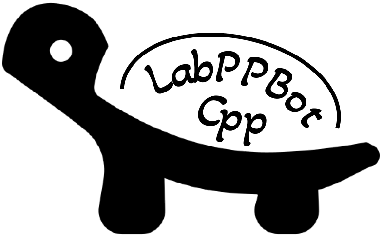
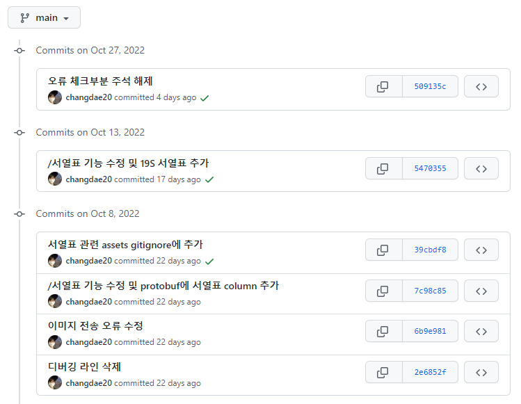

# LabPPBot_Cpp 

**LabPPBot_Cpp는 카카오톡 메신저에서 사용가능한 자동화 봇 클라이언트입니다.**

**Git을 이용한 형상관리 및 명령어를 통한 자동 업데이트를 지원하며, 사용자가 직접 명령어 및 봇의 행동을 제어할 수 있습니다.**

# Build Pipelines
|         |  `Clang-Format`  |`Build`     | 
| :---:   |      :---:     | :---:      |
| Status |  |  |

# Example
아래 예시는 Git을 이용한 자동 업데이트 기능입니다.

 

# Dependencies
* Formatting Library : [fmt](https://github.com/fmtlib/fmt)
* Data Format : [Protobuf](https://github.com/protocolbuffers/protobuf)
* Compiler : [MSVC](https://visualstudio.microsoft.com)
* Package Manager : [vcpkg](https://github.com/microsoft/vcpkg)

# TODOs
* HTTPS client 추가
* 주석 기반 자동 도움말 생성 기능 추가 (like swagger, dartdoc, sphinx, ...)

# License

**The MIT License (MIT)**

**Copyright (c) 2022 changdae20.**
